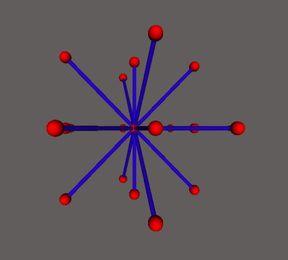

# Système de racine

Une visualisation des systèmes de racines en 3D, et un algorithme pour trouver un système de racines à partir d'un diagramme de Dynkin.  

## Lancement

Pour démarrer la visualisation, cliquer sur l'un des trois fichiers html A3, B3 ou C3 sous le répertoire src/3d_display.

Pour lancer le logiciel qui détermine un système racine à partir d'un diagramme Dynkin, cliquez sur le fichier main.html sous le répertoire src.

# Images

